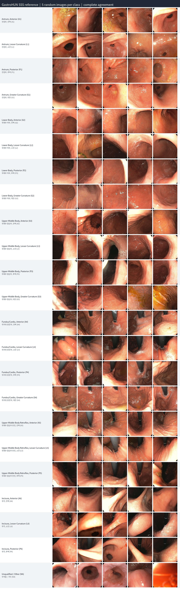

# EndoDINO

English | [한국어](README.ko.md)

GastroNet-5M DINOv2 ViT-B fine-tuned on GastroHUN for 23-class SSS (Systematic Screening Protocol for the Stomach) landmark classification: 22 Kenshi Yao stations plus NA.

## Classes

Each station code is a **wall** + **region** (for example `G3` = greater curvature of the upper-middle body). Walls: **A** anterior wall (전벽), **L** lesser curvature (소만), **P** posterior wall (후벽), **G** greater curvature (대만). Retroflex (5) and incisura (6) have no greater-curvature class.



| Code | English | Korean |
|------|---------|--------|
| A1 | Antrum, Anterior wall | 전정부, 전벽 |
| L1 | Antrum, Lesser curvature | 전정부, 소만 |
| P1 | Antrum, Posterior wall | 전정부, 후벽 |
| G1 | Antrum, Greater curvature | 전정부, 대만 |
| A2 | Lower body, Anterior wall | 위체하부, 전벽 |
| L2 | Lower body, Lesser curvature | 위체하부, 소만 |
| P2 | Lower body, Posterior wall | 위체하부, 후벽 |
| G2 | Lower body, Greater curvature | 위체하부, 대만 |
| A3 | Upper-middle body, Anterior wall | 위체중상부, 전벽 |
| L3 | Upper-middle body, Lesser curvature | 위체중상부, 소만 |
| P3 | Upper-middle body, Posterior wall | 위체중상부, 후벽 |
| G3 | Upper-middle body, Greater curvature | 위체중상부, 대만 |
| A4 | Fundus/cardia, Anterior wall | 위저부/분문부, 전벽 |
| L4 | Fundus/cardia, Lesser curvature | 위저부/분문부, 소만 |
| P4 | Fundus/cardia, Posterior wall | 위저부/분문부, 후벽 |
| G4 | Fundus/cardia, Greater curvature | 위저부/분문부, 대만 |
| A5 | Upper-middle body retroflex, Anterior wall | 위체중상부 반전, 전벽 |
| L5 | Upper-middle body retroflex, Lesser curvature | 위체중상부 반전, 소만 |
| P5 | Upper-middle body retroflex, Posterior wall | 위체중상부 반전, 후벽 |
| A6 | Incisura, Anterior wall | 위각부, 전벽 |
| L6 | Incisura, Lesser curvature | 위각부, 소만 |
| P6 | Incisura, Posterior wall | 위각부, 후벽 |
| NA | Unqualified / not applicable | 부적합 / 해당 없음 |

## Setup

```bash
pip install -e .
wandb login
```

Place files as:

```
weight/dinov2.pth              # GastroNet DINOv2 ViT-B
data/GastroHUN/                # patient folders, metadata/, official_splits/
data/test/                     # unlabeled frames for inference
```

- Model weights: [GastroNet-5M DINOv2 ViT-B](https://cortex.thetavision.nl/dataset-provider/listing/2/)
- Dataset: [GastroHUN](https://www.nature.com/articles/s41597-025-04401-5)

Official patient-level splits come from `data/GastroHUN/official_splits/image_classification.csv`. Training defaults to **complete 4-rater agreement** (paper Scenario A): 3,722 / 793 / 803 images. `OTHERCLASS` is mapped to `NA`.

## Train

```bash
python -m endodino.train
```

Logs to [Weights & Biases](https://wandb.ai) (`endodino` project). Use `--no-wandb` to skip. Checkpoints are ranked by validation macro-F1:

```
outputs/checkpoints/top1.pt
outputs/checkpoints/top2.pt
outputs/checkpoints/top3.pt
```

Linear probe instead of full fine-tune:

```bash
python -m endodino.train --freeze-backbone
```

Use a different GastroHUN label column (annotator or consensus):

```bash
python -m endodino.train --label-column "Triple agreement"
```

## Evaluate

```bash
python -m endodino.evaluate --split test --checkpoint outputs/checkpoints/top1.pt
python -m endodino.evaluate --split val --checkpoint outputs/checkpoints/top1.pt
```

Writes a classification report and confusion matrix to `outputs/eval/`.

## Infer

```bash
python -m endodino.infer --input data/test --checkpoint outputs/checkpoints/top1.pt
python -m endodino.infer --input data/test --checkpoint outputs/checkpoints/top1.pt --detailed
```

`--detailed` saves original, processed crop, and bilingual probability bars. Outputs:

```
outputs/predictions.csv
outputs/predictions/*.jpg
```
